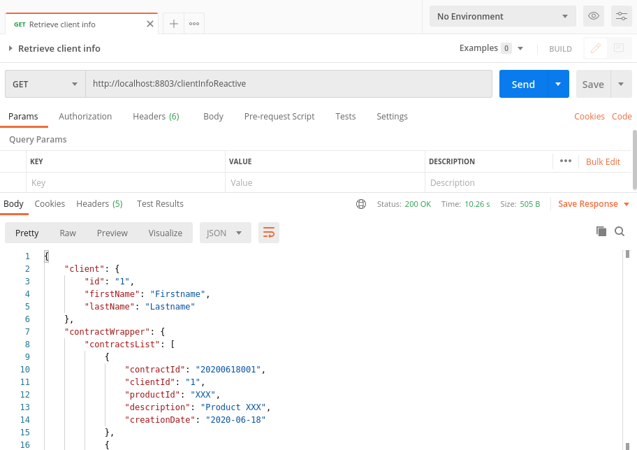

SYNCHRONOUS VS REACTIVE COMPARISON
--------------------------------------------------------------------------------------------

Microservice that acts as a BFF and retrieves information from other microservices,
wrapping those responses in just one response to be delivered to the Front End. 

Built with Java 8, Spring Boot 2, Gradle and Lombok.

--------------------------------------------------------------------------------------------

**Call to return info about a client that was retrieved from other two microservices,** 
**each of those microservices return a response in 10 seconds.**

**Those calls were executed in a synchronous way taking 20 seconds to complete the request:**

 --------------------------------------------------------------------------------------------
 
 **Same thing done with Reactive Programming using CompletableFuture, but just take 10 seconds:**

 --------------------------------------------------------------------------------------------
 
 