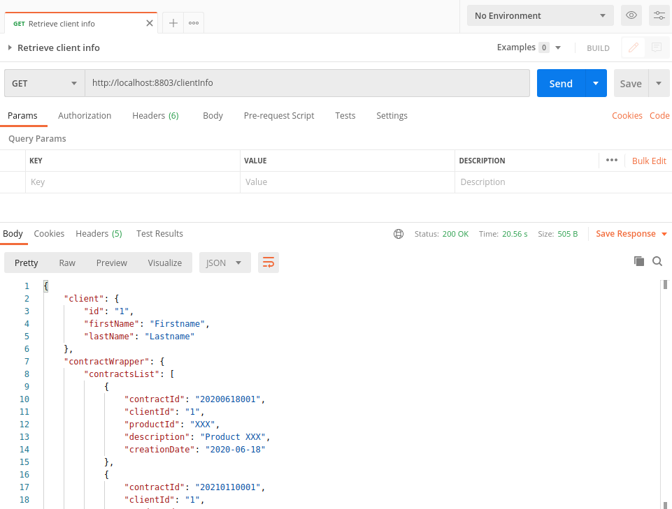

SYNCHRONOUS VS REACTIVE COMPARISON
--------------------------------------------------------------------------------------------

Microservice that acts as a BFF and retrieves information from other microservices,
wrapping those responses in just one response to be delivered to the Front End. 

Built with Java 8, Spring Boot 2, Gradle and Lombok.

--------------------------------------------------------------------------------------------

**Get call to return info about a client that was retrieved from other two microservices.**

**Those calls were executed using RestTemplate in a synchronous way taking 20 seconds to complete the request: **

 --------------------------------------------------------------------------------------------